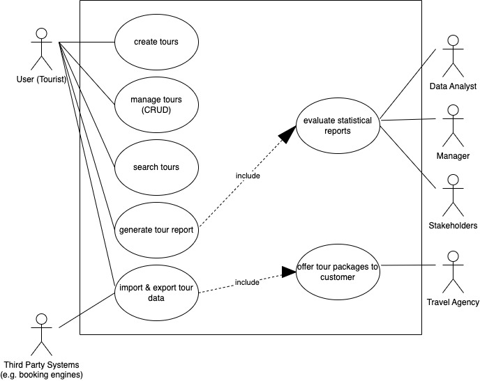
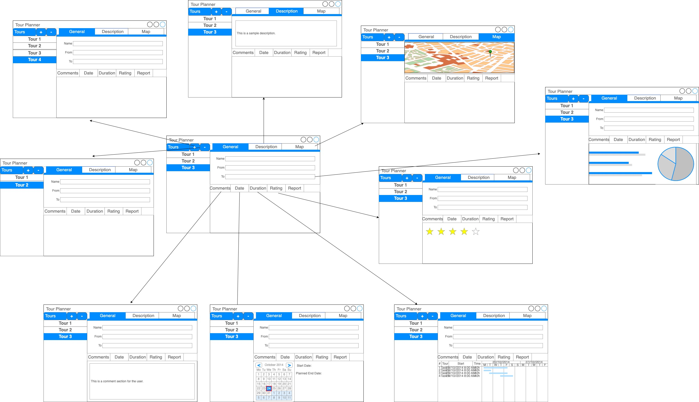

# TourPlanner_BhinderYamin
Bearbeiter: Siyar Yamin, Joben Preet Bhinder

## EINLEITUNG

Dies ist das Protokoll zum Semesterprojekt von Software Engineering 2.

Bei dem Projekt sollten wir eine Java-FX Applikation erstellen, bei der der Benutzer
Touren erstellen, löschen, bearbeiten und exportieren kann. Die Touren werden in einer
Postgres Datenbank gespeichert. Außerdem sollte die Applikation mit einem HTTP/REST-based
Server verbunden sein, der die Datenbankanfragen verarbeitet.

Im folgenden Protokoll werden die einzelnen Packages und deren Klassen beschrieben, sowie
die Funktionalität der Applikation.

Wir dürfen unseren TourPlanner präsentieren: **Dora the Explorer!**

## APP ARCHITEKTUR
Wir verwenden Layered Architecture - dabei wird das Projekt in verschiedene Module
(Application, Business, Data Access) aufgeteilt. Die einzelnen Module sind voneinander
entkoppelt - dies dient dazu, dass die einzelnen Module unabhängig voneinander entwickelt
werden können. Dadurch wird die Wartbarkeit und die Erweiterbarkeit des Projekts verbessert.

Jede Schicht hat klare Abhängigkeiten zu den darüber und darunter liegenden Schichten.
Dadurch entsteht eine klare Struktur und eine klare Kommunikation zwischen den Schichten. 
Änderungen in einer Schicht haben in der Regel keine Auswirkungen auf andere Schichten, 
solange die Schnittstellen zwischen den Schichten stabil bleiben.

### Application
Das Application Module ist das oberste Modul, welches die anderen Module verwendet.
Es enthält die Main Klasse, welche die Applikation startet. In dieser Schicht haben wir das
'architectural pattern' MVVM (Model-View-ViewModel) verwendet, damit die Business
Logic der Anwendung sauber von dem User-Interface getrennt werden kann. 

Die Application-Schicht ist gegliedert in:

#### - Model
Das Model enthält die Klassen, welche die Daten der Applikation repräsentieren.
Diese Klassen sind die _Tour_, die _TourLog_ und die _Adress_ Klasse.

Das Model enthält die Daten und die Methoden, um auf diese Daten zuzugreifen und sie zu manipulieren. 
Es bildet die Grundlage für die Anwendungslogik und stellt die Schnittstelle zwischen der View und dem ViewModel dar.

#### - View
Dieses Package enthält die Controller, welche die einzelnen Views steuern. Die
Controller sind mit den einzelnen Views verknüpft und steuern die Interaktion
mit dem User. Zudem enthält es ein Unterpackage _Dialogs_, welches die Dialoge
der Applikation enthält, bei denen der User mit der Applikation interagieren kann.

Die View ist für die Anzeige der Daten zuständig und reagiert auf Benutzerereignisse, leitet diese an das ViewModel 
weiter und aktualisiert die Darstellung entsprechend.

#### - ViewModel
Das ViewModel ist die Schnittstelle zwischen dem Model und der View. Es enthält
die Logik der Applikation, welche die Daten aus dem Model verarbeitet und an die
View weitergibt. 

Das ViewModel enthält die Präsentationslogik und stellt die Daten bereit, 
die von der View angezeigt werden sollen.

### Business
Das Business Module enthält die Business Logic der Applikation. Es enthält die
Klassen _PDFServiceImpl_ für das Generieren von PDFs und _RouteServiceImpl_ für
das Berechnen der Route.

### Data Access
Das Data Access Module enthält die Klassen, welche die Datenbankanfragen verarbeiten.
Es dient für die Kommunikation mit der Datenbank und stellt die Schnittstelle zwischen dem Business Layer
und der eigentlichen Datenbank dar.

## USE CASE DIAGRAM

[_präsentiert am 15.5.2023_]
## UX - WIREFRAME 

[_präsentiert am 15.5.2023_]

Tatsächlich haben wir uns relativ genau an das Wireframe gehalten. Wir haben
uns an die Positionierung der einzelnen Elemente gehalten und auch die Farben
sind relativ ähnlich. Allerdings haben wir uns dazu entschieden, einen Dark-Mode
einzuimplementieren, da wir der Meinung sind, dass dieser besser aussieht.

## LIBRARY DECISIONS
Wir haben uns vorrangig an die vorgeschlagenen Libraries aus dem Moodle Kurs gehalten.
Zum Beispiel haben wir wie vorgeschlagen die **itextpdf** Library verwendet, um PDFs zu generieren.
Auch **Slf4j** haben wir verwendet, um die Logs zu verwalten. Sowie **Hibernate**, um die Datenbankanfragen
zu verarbeiten.

Zusätzliche Libraries, die wir verwendet haben, sind:
- **controlsfx** - eine JavaFX Library, welche zusätzliche Controls zur Verfügung stellt
- **jMetro** - eine JavaFX Flat Design Library
- **tornadofx** - eine JavaFX Library, welche die Entwicklung von JavaFX Applikationen vereinfacht

weil wir zusätzliche UI-Elemente benötigt haben und die Applikation mit einem Flat Design, sowie einem Dark-Mode
verschönern wollten.

Zusätzlich haben wir fürs Testen auch die **testfx** Library verwendet.

## DESIGN PATTERNS
Zum einen verwenden wir das **MVVM** Pattern, um die Business Logic von dem User-Interface
zu trennen. Außerdem verwenden wir das **Factory** Pattern, um die einzelnen Services zu erstellen.
Es ist ein Entwurfsmuster, das zur Erzeugung von Objekten verwendet wird. 
Es gehört zur Kategorie der Erzeugungsmuster (Creational Patterns).
Das Factory Pattern ermöglicht die Abstraktion der Objekterzeugung, indem es eine gemeinsame Schnittstelle für die
Erstellung von Objekten definiert, anstatt sie direkt im Code zu instanziieren.
(siehe Klasse _ControllerFactory_)

Zudem verwenden wir das **Oberserver** Pattern, um die Views zu aktualisieren, wenn sich die Daten ändern.
Das Observer Pattern ist ein Entwurfsmuster, das aus einem Objekt, dem sogenannten Subjekt, und einer Liste von
abhängigen Objekten, den sogenannten Beobachtern, besteht. Ein Beobachter kann sich bei einem Subjekt registrieren,
um über Änderungen informiert zu werden. (siehe Klasse _TourLogViewModel_)

## UNIT TESTS
Wir haben uns dazu entschieden, einerseits die einzelnen Services, Funktionalitäten und die
Transformerklassen zu testen, um sicherzustellen, dass diese korrekt funktionieren.

Dazu zählen die Klassen:
- _ApplicationConfigPropertiesTest_ - dadurch können wir sicherstellen, dass die Konfigurationseinstellungen korrekt 
geladen werden und dass die Abhängigkeiten ordnungsgemäß verdrahtet sind.

- _ControllerFactoryTest_ - für die korrekte Instanziierung von den Controller-Klassen, dadurch können wir 
sicherstellen, dass die richtigen Controller-Typen erzeugt werden

- _FXMLDependencyInjectionTest_ - durch das Testen dieser Klasse können wir sicherstellen, dass die Abhängigkeiten
korrekt erkannt und injiziert werden, um eine reibungslose Interaktion zwischen den FXML-Dateien und den Controllern 
zu ermöglichen.

- _MapAPITest_ - um die Funktionaliät und Korrektheit der API zu testen

- _RouteServiceImplTest_ - um die Funktionaliät und Korrektheit der RouteService-Klasse zu testen

- _WeatherServiceImplTest_ - um die Funktionaliät und Korrektheit der WeatherService-Klasse zu testen

- Die Transformer-Klassen - Durch das Testen der Transformer-Klassen können wir sicherstellen, dass die konvertierten
Daten die erwartete Konsistenz aufweisen. Das bedeutet, dass die konvertierten Daten die gleichen Informationen 
enthalten und in der richtigen Struktur vorliegen, unabhängig vom Ausgangsformat.

Anderseits haben wir aber auch das User-Interface getestet, da wir erstmals eine JavaFX Applikation
geschrieben haben und sicherstellen wollten, dass die einzelnen Views korrekt funktionieren.

Dazu zählen die Klassen:
- _SearchTest_ - für das Suchen der einzelnen Touren und Logs - Testen der Funktionalität der Suchfunktion

- _UiTest_ - für das Testen der einzelnen Views - Testen der Funktionalität der Views -> für die Interaktion mit dem User

## UNIQUE FEATURES
Unser TourPlanner Projekt verfügt über zwei einzigartige Features - diese da wären der Dark-Mode
sowie die Integration einer Wetter-API.

### Dark-Mode
Um den persönlichen Präferenzen der Benutzer gerecht zu werden, haben wir einen Dark-Mode implementiert. Der Dark-Mode
bietet eine alternative visuelle Darstellung der Anwendung, indem er dunkle Farbtöne und Kontraste verwendet. Dies 
ermöglicht es Benutzern, die Anwendung auch in Umgebungen mit wenig Licht komfortabel zu nutzen und gleichzeitig ihre 
Augen zu schonen. Der Dark-Mode kann in den Einstellungen aktiviert/deaktiviert werden. Mittels der JMetro Library
implementiert.

### Wetter-API mit openweathermap.org
Diese API ermöglicht es uns, Echtzeit-Wetterinformationen für jede einzelne Tour anzuzeigen. Durch die Abfrage der
Wetterdaten basierend auf dem Start- und Zielort der Tour erhalten die Benutzer Informationen über das aktuelle Wetter 
während der geplanten Aktivität.

## ZEIT MANAGEMENT (+tracked time)
Wir haben drei Wochen vor Abgabe intensiv begonnen, an dem Projekt zu arbeiten.
Seit Projektbeginn haben wir jeden Tag ca. 6-8 Stunden an dem Projekt gearbeitet.

Geschätzter Zeitaufwand: 120 Stunden

## LESSONS LEARNED
Wir haben einige Sachen mitnehmen können, vor allem was die Planung der Software
betrifft. Wir haben gelernt, dass es sehr wichtig ist, sich vorher genau zu überlegen,
welche Anforderungen zu erfüllen sind, um Missverständnisse zu vermeiden und eine klare Richtung
für das Projekt zu haben.

Wir haben uns auch nochmals sehr viel mit dem MVVM-Pattern beschäftigt und haben und haben das Design sowie die 
Architektur im Voraus geplant, da eine solide Architektur das Fundament für eine skalierbare und wartbare Applikation bietet.

Auch haben wir das gemeinsame Arbeiten mit Git verbessert und haben gelernt, wie man
mit Git effizient im Team arbeitet.

## GIT
Da unser GitHub Repository, das wir für unser Projekt verwendet haben, 
auf privat gestellt ist, haben wir Sie als contributor eingeladen. 
Sie müssten eine Mail bekommen haben und können die Einladung akzeptieren.

https://github.com/siyar00/TourPlanner.git